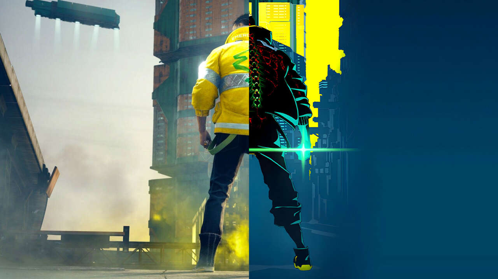

<!-- CRTL + K + C  -->

<!-- Imagem usando Markdown  -->
<!--   -->

<!-- Imagem usando HTML  -->

    

<!-- # Titulo MarkDown

## Titulo menor

###### Titulo

<h1>Titulo HTML</h1>

 <h6>Titulo HTML</h6> -->

 ## Descrição do projeto

 

Cyberpunk 2077 é um jogo de RPG de ação desenvolvido pela CD Projekt Red, ambientado no futurístico Night City, uma metrópole distópica repleta de tecnologias avançadas, corrupção e violência. Os jogadores assumem o papel de V, um mercenário personalizável em busca de um misterioso implante cibernético que pode garantir a imortalidade. O jogo apresenta uma narrativa profunda, escolhas morais impactantes e um mundo aberto imersivo, repleto de missões e personagens complexos. A história de Cyberpunk 2077 é uma mistura de mistério, intriga e ação, que convida os jogadores a explorarem as consequências de viver em uma sociedade altamente tecnologizada, mas cheia de desigualdade e perigos.

 

 

Com um visual deslumbrante e uma trilha sonora marcante, o jogo oferece uma experiência envolvente e única em cada jogada, graças à liberdade de escolhas que impactam o desenvolvimento da trama e o destino de seus personagens. Mesmo enfrentando um lançamento tumultuado, Cyberpunk 2077 passou por atualizações significativas para corrigir bugs e otimizar a performance, solidificando-se como um título que continua a cativar fãs de ficção científica e jogos de mundo aberto. Em Cyberpunk 2077, a linha entre o homem e a máquina é tênue, e cada decisão tomada pode alterar irrevogavelmente o curso da história.

 

 ## Tabela de conteúdos

<ul>
 

    <li><a href="#">Descrição do Projeto</a></li>
    <li><a href="#">Status do Projeto</a></li>

</ul>

<!--

<a href="#">Descrição do Projeto<a>
    | <a href="#">Status do Projeto<a>
    
 -->

## Status do projeto

<h4 align="center">
  Em construção :rocket:
  </h4>

